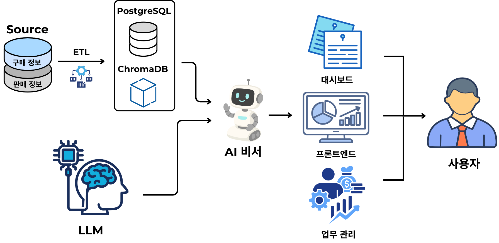
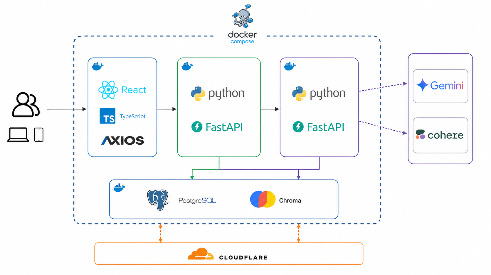
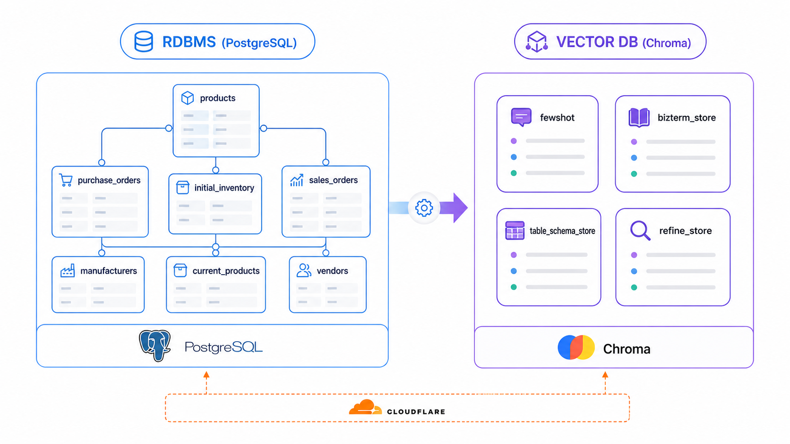
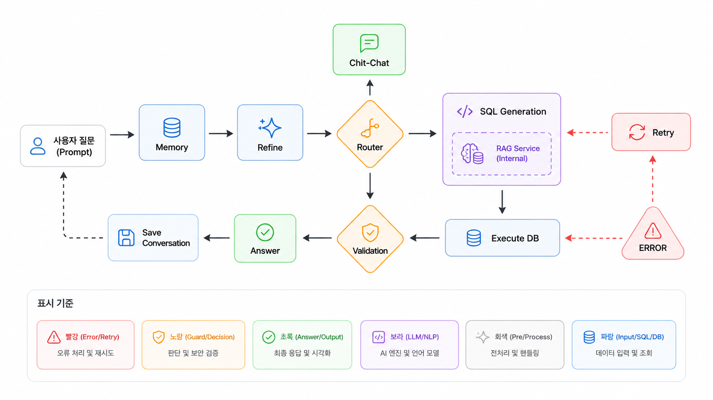
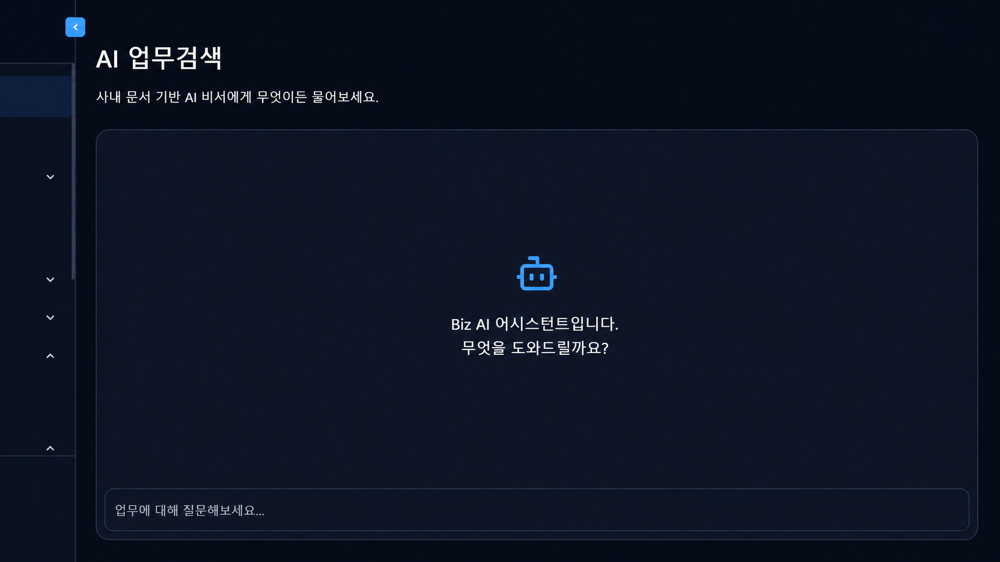

# 휴먼 AI 교육센터 심층 데이터 분석 과정 6기
## LLM/RAG 기반 기업 업무형 AI 비서 설계 및 구현

### 목차
1. [프로젝트 개요](#프로젝트-개요)
2. [프로젝트 구조](#프로젝트-구조)
3. [프로젝트 환경](#프로젝트-환경)
4. [데이터와 모델](#데이터와-모델)
5. [LLM 서버 구현](#llm-서버-구현)
6. [추후 연구 방향](#추후-연구-방향)

### 프로젝트 개요

- 자연어 질문만으로 회사 내부 DB의 재고·매출·매입 데이터를 즉시 조회할 수 있는 **전자부품 유통사용 AI 비서**입니다. 본 프로젝트에서는 LLM 서버의 설계와 구현을 담당했습니다.
- 기존 챗봇은 내부 DB와 직접 연결되지 않아 실무 데이터 조회가 불가능했고, 대화 맥락 유지나 완전 자동화에도 한계가 있었습니다.
   > "이번 분기 매출 알려줘"라는 질문에 실제 DB 조회 없이 추정 답변만 제공하는 식입니다.
- 이 한계를 극복하기 위해 **LLM + RAG + Orchestration** 세 가지를 결합했습니다. LLM의 환각은 RAG의 근거 기반 검색이 보완하고, RAG의 검색 의존성은 Orchestration이 통제하며, LLM의 비용·성능 문제는 모델 전략 조정으로 해결하는 구조입니다.
  

### 프로젝트 구조

- 사용자의 자연어 질문은 LLM을 거쳐 처리되며, **PostgreSQL**의 정형 데이터(구매·판매 정보)와 **ChromaDB**의 벡터 데이터(RAG 보조 자료)를 조합해 답변을 생성합니다.
- 생성된 답변은 AI 비서를 통해 프론트엔드에 전달되고, 사용자는 챗봇·대시보드·업무 관리 화면에서 결과를 확인합니다.
  

### 프로젝트 환경

- 컨테이너 단위 배포와 환경 일관성을 확보하기 위해 **Docker Compose**로 전체 시스템을 구성했습니다.
- 백엔드와 LLM 서버는 비동기 처리에 강한 **Python + FastAPI**로 구현해, 다수 사용자의 동시 요청을 효율적으로 처리합니다.
- LLM 서버는 외부 AI API(**Gemini**, **Cohere**)를 호출하여 자연어 처리와 검색 재정렬을 수행합니다. 외부 API 기반 구조는 인프라 부담 없이 빠른 프로토타이핑이 가능하다는 장점이 있습니다.
- 데이터 계층은 정형 데이터용 **PostgreSQL**과 벡터 검색용 **ChromaDB**를 병용해 RAG 파이프라인의 정확도와 속도를 모두 확보했고, 외부에서 내부 DB로의 안전한 접근은 **Cloudflare 터널**로 처리합니다.
- 프론트엔드는 **React + TypeScript + Axios** 기반으로 구성됩니다.
  

### 데이터와 모델

#### 데이터

- **관계형 DB (PostgreSQL)** — 전자부품 유통 도메인을 반영해 7개 테이블로 설계했습니다. 제품 마스터(`products`), 제조사(`manufacturers`), 고객사(`vendors`), 매입 이력(`purchase_orders`), 매출 이력(`sales_orders`), 실시간 재고(`current_products`), 초기 재고(`initial_inventory`)가 `part_number`를 중심으로 연결됩니다.
- **벡터 DB (ChromaDB)** — RAG 보조 데이터를 4개 컬렉션으로 분리해 관리합니다.
   > `fewshot`(질의–SQL 생성 예시), `bizterm_store`(비즈니스 용어 정의), `table_schema_store`(테이블 스키마 정보), `refine_store`(사용자 질문 교정)
  

#### 모델 선정
- 무료 API 모델 중심으로 검토했고, 공개 벤치마크와 도메인 샘플 테스트를 기준으로 판단했습니다.
- **LLM** — SQL 생성 정확도와 한국어 이해도가 우수한 **Gemini 2.5 Flash**를 선정했습니다.
- **임베딩** — 동일 Gemini 생태계와의 일관성, 그리고 다국어 처리 성능을 고려해 **Gemini embedding-v1**을 선정했습니다.
- **리랭커** — 한국어 포함 다국어 검색 품질이 검증된 **Cohere rerank-multilingual-v3.0**을 적용해 RAG 검색 결과의 정확도를 보강했습니다.
  

### LLM 서버 구현

> 자연어 질문을 SQL로 변환해 DB를 조회하고, 그 결과를 다시 자연어로 응답하는 **에이전트 파이프라인**입니다. FastAPI 기반으로 구현했고, 노드 간 흐름과 분기는 LangGraph로 관리합니다.

#### 에이전트 그래프 흐름

- 사용자의 질문은 아래 순서로 처리됩니다.
   > **Memory → Refine → Router → (SQL Gen → Execute DB → Validate) → Answer → Save**
- **전처리 단계 (Memory · Refine · Router)** — 이전 대화 맥락을 주입하고, 오타나 파트넘버 오기재를 보정한 뒤, 질문 유형을 분류합니다. `INVENTORY` 질의는 SQL 생성으로, `CHIT_CHAT`/`TECH_SALES`는 답변 생성으로 분기됩니다.
- **SQL 생성 및 실행 단계 (SQL Gen · Execute DB · Validate)** — RAG로 fewshot 예시·비즈니스 용어·스키마 정보를 검색해 LLM이 SQL을 생성하고, 5단계 정적 검증을 거쳐 PostgreSQL에 실행합니다. 결과의 NULL 비율·음수 매출·극단값 등 비즈니스 이상치를 검사해, 이상이 감지되면 SQL Gen으로 되돌아갑니다.
- **응답 단계 (Answer · Save)** — 실제 DB 조회 결과를 FACT로 LLM에 주입해 자연어 답변을 생성하고, 질문·답변·SQL·처리시간을 DB에 저장해 다음 대화의 기억으로 활용합니다.
   > 재시도는 최대 3회까지 수행되며, 초과 시 사용자에게 에러 메시지를 안내합니다.
  

#### 핵심 설계 포인트
- **하이브리드 RAG 검색** — 벡터 유사도(60%) + BM25 키워드 검색(40%)을 병합한 후 Cohere로 재정렬하는 3단계 검색을 구현했습니다. 개별 전략 실패 시 자동 fallback해 서비스가 중단되지 않습니다.
- **SQL 안전 검증** — `SELECT *` 금지, 존재하지 않는 테이블·컬럼 차단, Cartesian Product 감지, 허용된 JOIN 조합 강제 등 5단계 정적 검증으로 LLM이 생성한 SQL의 안전성을 확보했습니다.
- **에러 기반 재시도** — DB 실행 실패 시 에러 메시지를 분석해 수정 힌트를 생성하고, 다음 SQL 생성 프롬프트에 삽입합니다. LLM이 같은 실수를 반복하지 않도록 한 설계입니다.
- **Hallucination 방지** — 답변 생성 시 LLM에게 실제 DB 조회 결과만을 FACT로 명시해, 없는 데이터를 지어내는 것을 차단했습니다.
- **Provider Registry 패턴** — LLM·임베딩·리랭커를 각각 추상 인터페이스로 분리하고 단일 레지스트리에서 관리합니다. `dependency.py` 한 곳만 수정하면 다른 모델로 교체할 수 있는 구조입니다.
  

#### 실제 동작 화면

- LLM 서버를 호출하는 챗봇 인터페이스입니다. 자연어로 질문하면 위 파이프라인을 거쳐 답변을 반환합니다.
  

### 추후 연구 방향
- 질문 유형과 복잡도에 따라 호출할 LLM을 동적으로 선택하는 **LLM 라우팅**을 도입해 API 비용을 최적화합니다. 현재 단일 모델(Gemini)에 의존하는 구조를 다양한 API로 확장하는 기반이 됩니다.
- 도메인 데이터를 추가 확보해 SQL 생성 프롬프트와 비즈니스 로직 규칙을 정밀하게 개선하고, refine·rerank 임계값 등 주요 파라미터를 체계적인 테스트로 조정합니다.
- 대화 기억 구조를 단기·장기 메모리로 계층화해 맥락 유지 성능을 고도화합니다.
- 챗봇 답변에 차트·그래프 시각화 기능을 추가해 데이터 인사이트 전달력을 높입니다.
  
